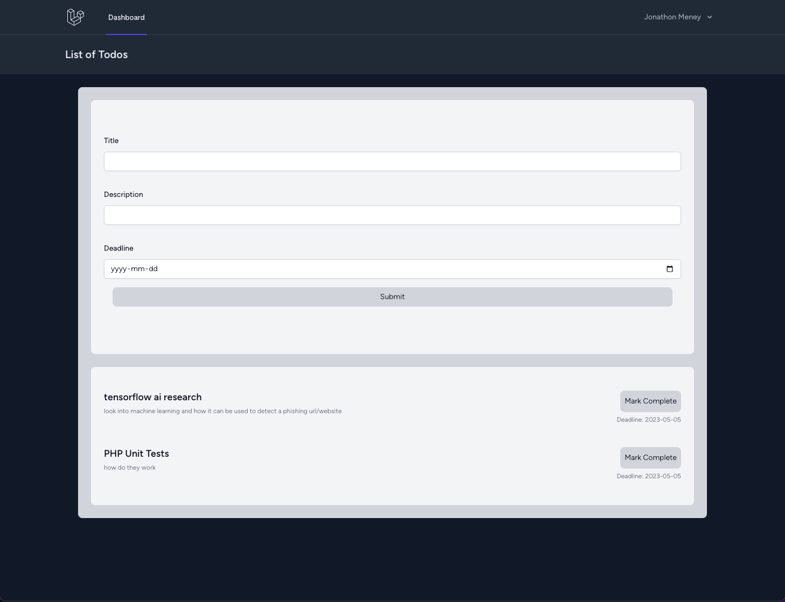

# Todo Website

Simple todo application. Written using Laravel/PHP and Vue.js for the frontend.
Also uses Tailwind.css. Gained knowledge of routing, Model View Controller model (MVC), Vue.js,
OOP based PHP programming, Laravel, Eloquent, and PHPUnit tests.

## Images

